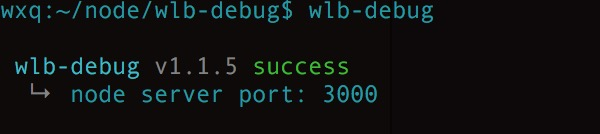

##wlb-debug
该包为app webview调试工具，支持前端页面与原生app交互调试（调用原生接口）<br>  
暂不支持前端页面业务逻辑与原生app的调试
###Installation
```sh
npm install -g wlb-debug

cd /project/static/  

npm link wlb-debug
```
### build
```sh
1. cd static/

#default port 3000
2. wlb-debug
```


3 打包本地ip app包<br>
4 将项目中的webview.js 改为webview.bug.js<br>
5 选择是否打开debug，如下<br>
```sh
wlb.ready({
    debug:{
        switch: true  #debug开关
        host: '',    #本地ip,端口默认3000(Examples: 192.168.1.20)
    }
})
#在app中访问需要debug页面，进行操作，在终端即可看到输出信息
```
